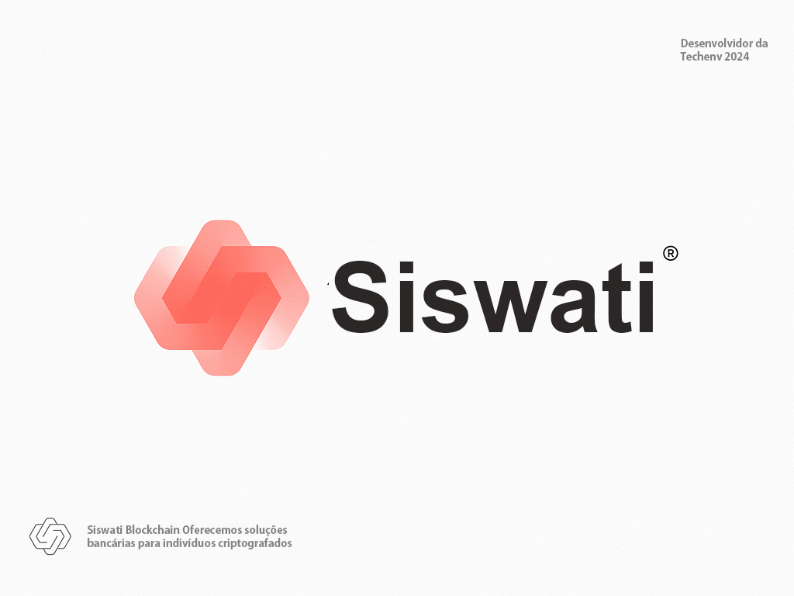

# Siswati blockchain (siswati-token)

> Implementação e testes para contratos principais do siswati-token

## Resumo

A [**Siswati Token**](https://siswati.sistay.pt) Techenv é uma agencia digital freelancer de desenvolvimento de software comprometida em fornecer soluções de alta qualidade para startups, pequenas e médias empresas. Nossa principal experiência inclui:  soluções Angular Developer, Ionic - Build iOS, Android, blockchain, desde o desenvolvimento de protocolos FinTech e L1 até a otimização de processos de negócios baseados em blockchain.

## Qual é a diferença entre unidades codificadas e unidades não codificadas? 

As unidades codificadas e não codificadas definem os níveis dos fatores em um projeto experimental. Por exemplo, você deseja determinar qual combinação de configurações de pressão e tipo de primer otimiza a adesão da tinta. As configurações baixas em seu experimento (Pressão = 310 e Tipo de Primer = Um) são identificadas por -1 em unidades codificadas e as configurações altas (Pressão = 380 e Tipo de Primer = Dois) são identificadas por 1 em unidades codificadas. 

Por padrão, o Minitab usa unidades codificadas para fazer a análise. As unidades codificadas permitem comparar o tamanho dos coeficientes (em uma escala comum) para determinar qual fator tem o maior impacto na resposta. Se um projeto for analisado em unidades não codificadas (ou naturais), ele poderá não ser mais ortogonal. A ortogonalidade permite estimar os termos do modelo de forma independente, facilitando a análise porque é possível remover termos que não são significativos sem alterar as estimativas dos termos que permanecem no modelo. 
Este projeto ainda não esta codificado, esperando esperando a primeira Codificação do lider do projeto ou dos membros.

# Apresentação de Portfólio - da Pagina web Golen
minhsas criações e processos com uma abordagem igualmente profissional e criativa usando soluções Angular Developer, Ionic - Build iOS, Android, blockchain
(https://golen.ncdc.pt)